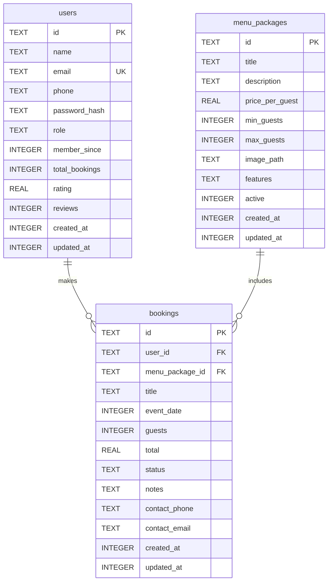
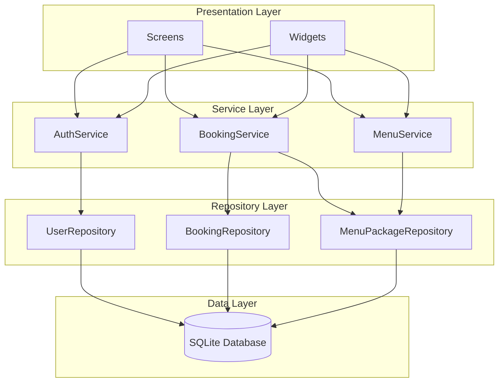

# Restaurant Event Booking App - Architecture Plan

## Executive Summary

This document outlines the comprehensive architecture plan for upgrading the Restaurant Event Booking App. The plan covers:
1. **SQLite Database Implementation** - Replacing mock data with persistent storage
2. **UI/UX Improvements** - Enhancing the visual design while preserving the color palette

---

## Part 1: SQLite Database Architecture

### Database Schema



### Data Flow Architecture



### Implementation Files

#### Phase 1: Infrastructure
| File | Purpose |
|------|---------|
| `lib/data/database/database_helper.dart` | SQLite database singleton with connection management |
| `lib/data/database/migrations/migration_v1.dart` | Initial schema creation |
| `lib/core/constants/app_constants.dart` | Database and app constants |
| `lib/di/service_locator.dart` | Dependency injection setup |

#### Phase 2: Repositories
| File | Purpose |
|------|---------|
| `lib/domain/interfaces/i_user_repository.dart` | User repository interface |
| `lib/domain/interfaces/i_booking_repository.dart` | Booking repository interface |
| `lib/domain/interfaces/i_menu_package_repository.dart` | Menu package repository interface |
| `lib/data/repositories/user_repository.dart` | SQLite user repository implementation |
| `lib/data/repositories/booking_repository.dart` | SQLite booking repository implementation |
| `lib/data/repositories/menu_package_repository.dart` | SQLite menu package repository implementation |

#### Phase 3: Services
| File | Purpose |
|------|---------|
| `lib/domain/services/auth_service.dart` | Authentication business logic |
| `lib/domain/services/booking_service.dart` | Booking business logic |
| `lib/domain/services/menu_service.dart` | Menu management business logic |

---

## Part 2: UI/UX Improvement Plan

### Current UI Analysis

| Component | Current State | Issues |
|-----------|---------------|--------|
| Buttons | Basic ElevatedButton/OutlinedButton | No visual hierarchy, inconsistent styling |
| Cards | Simple Container with border | Lack of depth, no hover states |
| Forms | TextField with basic decoration | No validation feedback, minimal labels |
| Lists | Basic ListView with ListTile | No visual separation, plain design |
| Navigation | AppBar with back button | No bottom nav, limited navigation options |
| Loading | None | No loading indicators |
| Empty States | None | No empty state messaging |

### Proposed Improvements

#### 1. Enhanced Widget Library

##### Buttons
```
Current: ElevatedButton, OutlinedButton
Proposed:
├── PrimaryButton (filled, prominent actions)
├── SecondaryButton (outlined, secondary actions)
├── TextButton (subtle, tertiary actions)
├── IconButton (icon-only actions)
└── LoadingButton (with loading state)
```

##### Cards
```
Current: Container with BoxDecoration
Proposed:
├── BaseCard (standard surface)
├── ElevatedCard (with shadow)
├── InteractiveCard (with ripple/hover)
├── PackageCard (menu package display)
├── BookingCard (booking display)
└── StatCard (dashboard metrics)
```

##### Form Fields
```
Current: TextField with InputDecoration
Proposed:
├── AppTextField (with validation states)
├── AppDropdown (styled dropdown)
├── AppDatePicker (styled date picker)
├── AppNumberField (with +/- buttons)
└── AppSwitch (styled toggle)
```

#### 2. Typography Scale

| Style | Size | Weight | Usage |
|-------|------|--------|-------|
| Display | 32sp | Bold | Splash screen title |
| Headline | 24sp | SemiBold | Page titles |
| Title | 20sp | SemiBold | Section headers |
| Subtitle | 16sp | Medium | Card titles |
| Body | 14sp | Regular | Body text |
| Caption | 12sp | Regular | Secondary text |
| Label | 14sp | Medium | Button text |

#### 3. Spacing System

```
Spacing Scale:
├── xs: 4dp
├── sm: 8dp
├── md: 16dp
├── lg: 24dp
├── xl: 32dp
└── xxl: 48dp

Usage:
- Between list items: sm (8dp)
- Card padding: md (16dp)
- Section spacing: lg (24dp)
- Screen padding: md (16dp)
```

#### 4. Color Usage Guidelines

```
Existing Palette (Keep):
├── Background: #0E0E0E (black)
├── Surface: #1A1A1A
├── Accent: #FFC107 (yellow)
├── Secondary: #FF9800 (orange)
├── Text Primary: #EDEDED
├── Text Secondary: #BDBDBD
├── Success: #4CAF50
├── Error: #F44336
└── Border: #3A3A3A

Usage Recommendations:
- Yellow accent: CTAs, active states, important metrics
- Orange accent: Links, secondary actions
- Surface: Cards, input backgrounds
- Border: Dividers, input borders, card outlines
```

#### 5. Screen-by-Screen Improvements

##### Login/Register Screens
- Add app logo/branding at top
- Improve form field spacing
- Add password visibility toggle
- Add form validation with error messages
- Add loading state on submit

##### User Dashboard
- Add greeting with user name
- Add quick action cards instead of plain buttons
- Add upcoming booking preview
- Add bottom navigation bar

##### Booking Form
- Multi-step form with progress indicator
- Package selection with cards, not dropdown
- Calendar widget for date selection
- Guest count with +/- buttons
- Real-time price calculation

##### Booking History
- Segmented control for status filtering
- Booking cards with status indicators
- Pull-to-refresh functionality
- Empty state for no bookings

##### Admin Dashboard
- Grid of metric cards with icons
- Quick action buttons
- Recent bookings list
- Package status overview

---

## Part 3: Implementation Order

### Recommended Sequence

```mermaid
gantt
    title Implementation Roadmap
    dateFormat X
    axisFormat %s
    
    section Phase 1 - Setup
    Add dependencies           :p1a, 0, 1
    Create database helper     :p1b, after p1a, 1
    Create migrations          :p1c, after p1b, 1
    
    section Phase 2 - Data
    Update models with toMap/fromMap :p2a, after p1c, 1
    Implement repositories          :p2b, after p2a, 2
    Implement services              :p2c, after p2b, 2
    Setup DI                        :p2d, after p2c, 1
    
    section Phase 3 - Integration
    Update screens to use services  :p3a, after p2d, 3
    Add loading/error states        :p3b, after p3a, 1
    Remove mock service             :p3c, after p3b, 1
    
    section Phase 4 - UI/UX
    Create enhanced widgets         :p4a, after p3c, 2
    Update screen layouts           :p4b, after p4a, 3
    Add animations                  :p4c, after p4b, 1
```



### Detailed Task List

#### Phase 1: Infrastructure Setup
1. Add `sqflite`, `path`, `get_it`, `uuid` to `pubspec.yaml`
2. Create `lib/core/constants/app_constants.dart`
3. Create `lib/data/database/database_helper.dart`
4. Create `lib/data/database/migrations/migration_v1.dart`
5. Create `lib/di/service_locator.dart`

#### Phase 2: Data Layer Implementation
6. Update `lib/models/user.dart` with `fromMap()`, `toMap()`, add `passwordHash`, `role`, timestamps
7. Update `lib/models/menu_package.dart` with `fromMap()`, `toMap()`, add `features`, timestamps
8. Update `lib/models/booking.dart` with `fromMap()`, `toMap()`, add `notes`, contact fields, timestamps
9. Create `lib/domain/interfaces/i_user_repository.dart`
10. Create `lib/domain/interfaces/i_booking_repository.dart`
11. Create `lib/domain/interfaces/i_menu_package_repository.dart`
12. Create `lib/data/repositories/user_repository.dart`
13. Create `lib/data/repositories/booking_repository.dart`
14. Create `lib/data/repositories/menu_package_repository.dart`

#### Phase 3: Service Layer Implementation
15. Create `lib/domain/services/auth_service.dart`
16. Create `lib/domain/services/booking_service.dart`
17. Create `lib/domain/services/menu_service.dart`
18. Register all services in `service_locator.dart`
19. Initialize services in `main.dart`

#### Phase 4: UI Integration
20. Update `AdminDashboardPage` to use services
21. Update `AdminManageMenuPage` to use services
22. Update `AdminManageBookingsPage` to use services
23. Update `UserDashboardPage` to use services
24. Update `BookingFormPage` to use services
25. Update `BookingHistoryPage` to use services
26. Update `UserProfilePage` to use services
27. Update `LoginPage` to use AuthService
28. Update `RegisterPage` to use AuthService
29. Add loading states to all screens
30. Add error handling to all screens
31. Delete `lib/services/mock_data_service.dart`

#### Phase 5: UI/UX Enhancements
32. Create `lib/presentation/widgets/buttons/` directory with enhanced buttons
33. Create `lib/presentation/widgets/cards/` directory with card variants
34. Create `lib/presentation/widgets/forms/` directory with form components
35. Create `lib/presentation/widgets/common/` with loading, empty states
36. Update `app_theme.dart` with typography scale
37. Apply new widgets to all screens
38. Add bottom navigation to user screens
39. Add form validation UI
40. Add pull-to-refresh to list screens

---

## Appendix A: Model Updates Required

### User Model Changes
```dart
// Add fields:
final String passwordHash;
final String role; // 'user' or 'admin'
final DateTime createdAt;
final DateTime updatedAt;

// Add methods:
factory User.fromMap(Map<String, dynamic> map);
Map<String, dynamic> toMap();
User copyWith({...});
```

### MenuPackage Model Changes
```dart
// Add fields:
final int? maxGuests;
final String? imagePath;
final List<String> features;
final DateTime createdAt;
final DateTime updatedAt;

// Add methods:
factory MenuPackage.fromMap(Map<String, dynamic> map);
Map<String, dynamic> toMap();
MenuPackage copyWith({...});
```

### Booking Model Changes
```dart
// Add fields:
final String? notes;
final String? contactPhone;
final String? contactEmail;
final DateTime createdAt;
final DateTime updatedAt;

// Add methods:
factory Booking.fromMap(Map<String, dynamic> map);
Map<String, dynamic> toMap();
Booking copyWith({...});
```

---

## Appendix B: Dependencies to Add

```yaml
# pubspec.yaml additions
dependencies:
  sqflite: ^2.3.0        # SQLite database
  path: ^1.8.3           # Path utilities
  get_it: ^7.6.4         # Dependency injection
  uuid: ^4.2.1           # Generate unique IDs
```

---

## Appendix C: File Structure Summary

```
lib/
├── main.dart
├── app_router.dart
├── core/
│   ├── constants/
│   │   └── app_constants.dart
│   └── errors/
│       └── exceptions.dart
├── data/
│   ├── database/
│   │   ├── database_helper.dart
│   │   └── migrations/
│   │       └── migration_v1.dart
│   └── repositories/
│       ├── user_repository.dart
│       ├── booking_repository.dart
│       └── menu_package_repository.dart
├── di/
│   └── service_locator.dart
├── domain/
│   ├── interfaces/
│   │   ├── i_user_repository.dart
│   │   ├── i_booking_repository.dart
│   │   └── i_menu_package_repository.dart
│   └── services/
│       ├── auth_service.dart
│       ├── booking_service.dart
│       └── menu_service.dart
├── models/
│   ├── booking.dart
│   ├── menu_package.dart
│   └── user.dart
├── presentation/
│   ├── screens/
│   │   ├── admin/
│   │   ├── auth/
│   │   ├── guest/
│   │   └── user/
│   ├── theme/
│   │   ├── app_theme.dart
│   │   └── colors.dart
│   └── widgets/
│       ├── buttons/
│       ├── cards/
│       ├── common/
│       └── forms/
└── [legacy - to be reorganized]
    ├── screens/ (move to presentation/screens)
    ├── widgets/ (move to presentation/widgets)
    └── theme/ (move to presentation/theme)